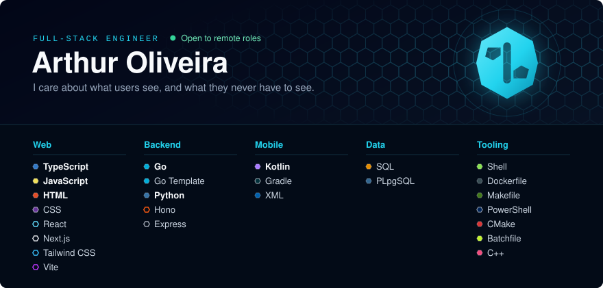

Hi, I'm Arthur. I'm a full-stack developer, and I work remotely.

Most of what you'll find here started as a small irritation I couldn't let go of. A server I had to babysit from my phone. Paperwork that ate people's evenings. Tools that wouldn't talk to each other. I'd notice it, then keep noticing it, until building something was easier than living with it.

I enjoy the part people see: making a screen feel obvious. But I get just as much out of the part they don't. A server restarts in the middle of the night and nobody notices. A payment goes through exactly once. An app keeps working after the signal is gone.

**Open to remote full-stack roles.**

### What I've built, and why

<table>
<tr>
<td width="50%" valign="top">

**[server-control-panel](https://github.com/eranoix/server-control-panel)** 
Go · Kotlin · Alpine.js

**A web and phone dashboard to look after a Linux server without living in the terminal.**

**Why I built it.** Looking after my own server meant a dozen terminal windows, and the worst moments were when something broke and all I had was my phone.

**WHAT YOU SEE** 
One panel for everything on the server: apps, logs, files, scheduled jobs and a terminal. In the browser, or in an Android app made for thumbs.

**WHAT YOU NEVER HAVE TO SEE** 
A single Go program. If it restarts, your open terminal is still there when it comes back.

</td>
<td width="50%" valign="top">

**[offshore-report-app](https://github.com/eranoix/offshore-report-app)** 
React · Node · Python

**An app that fills in and prints the reports offshore technicians have to write, even with no internet.**

**Why I built it.** After a long shift at sea, technicians still have to write long, repetitive reports, on a ship where the internet comes and goes.

**WHAT YOU SEE** 
Fill in the form on the phone, print it exactly like the official one, and get help writing it in your own words.

**WHAT YOU NEVER HAVE TO SEE** 
It works offline, and the writing help can only use what the person actually said. Nobody should sign a report about a job that never happened.

</td>
</tr>
<tr>
<td width="50%" valign="top">

**[ai-api-bridge](https://github.com/eranoix/ai-api-bridge)** 
TypeScript · SQL

**A bridge that lets a program written for one AI API talk to another, without changing its code.**

**Why I built it.** I had tools I liked that only worked with one AI provider, and I wanted to use them with another one.

**WHAT YOU SEE** 
The tools keep working as they are. The bridge translates in the middle, and a small dashboard shows who is using what.

**WHAT YOU NEVER HAVE TO SEE** 
When several processes renew the same login at the same moment, only one does it and the others wait for the result.

</td>
<td width="50%" valign="top">

**[safe-code-publisher](https://github.com/eranoix/safe-code-publisher)** 
Python

**Publishes a clean copy of a private project and refuses if any personal data is left in it.**

**Why I built it.** Most of my work is private and full of names, addresses and passwords. Cleaning it by hand every time is how leaks happen.

**WHAT YOU SEE** 
Nothing, on purpose. It builds the public copy and says no while anything sensitive is still inside. Every project on this page went through it.

**WHAT YOU NEVER HAVE TO SEE** 
The check runs on the finished copy, not on the original, so nothing can slip in between.

</td>
</tr>
<tr>
<td width="50%" valign="top">

**[reliable-task-queue](https://github.com/eranoix/reliable-task-queue)** 
TypeScript · SQL

**A task queue that makes sure each job, like a payment, happens exactly once, even when something crashes.**

**Why I built it.** Imagine the app freezing while you pay, and nobody knowing if you were charged. Someone has to decide whether to try again.

**WHAT YOU SEE** 
Nothing, and that's the point. When it works, nobody knows it exists.

**WHAT YOU NEVER HAVE TO SEE** 
The database itself refuses to record the same action twice. It's a small, open version of a system I built for production.

</td>
<td width="50%" valign="top">

**[clinic-booking-app](https://github.com/eranoix/clinic-booking-app)** 
Next.js · React · TypeScript · SQL

**Online booking for a clinic, with a page for patients and a front desk for staff.**

**Why I built it.** Two people book the same time seconds apart, and someone ends up making an awkward phone call.

**WHAT YOU SEE** 
Patients pick a time and can change or cancel it from a link. Staff see the day's diary, move appointments and book a whole course of sessions at once.

**WHAT YOU NEVER HAVE TO SEE** 
A double booking is simply impossible: the check happens at the exact moment of booking. One command runs it all, with invented data.

</td>
</tr>
<tr>
<td width="50%" valign="top">

**[kids-study-app](https://github.com/eranoix/kids-study-app)** 
Electron · TypeScript · PowerShell

**A study app for kids: practice tests at the right level, stories read aloud, and flashcards.**

**Why I built it.** I wanted my kids to practise at exactly their level, and to have books read aloud with them when I couldn't.

**WHAT YOU SEE** 
Each child gets tests for their grade, stories read aloud with every word highlighted, and flashcards for what they got wrong. Parents see how everyone is doing.

**WHAT YOU NEVER HAVE TO SEE** 
Progress is encrypted on the computer, and syncing two computers never makes anyone's progress go backwards.

</td>
<td width="50%" valign="top">

**[phone-notes-sync](https://github.com/eranoix/phone-notes-sync)** 
TypeScript · PostgreSQL

**Copies the notes you write on your phone into a database within seconds.**

**Why I built it.** My phone notes were stuck on the phone. Every time another tool needed them, I copied them by hand.

**WHAT YOU SEE** 
A page with all your notes, updating live as you write, edit or delete them on the phone.

**WHAT YOU NEVER HAVE TO SEE** 
If the connection drops it reconnects on its own, and it never mistakes an edit for a deletion.

</td>
</tr>
<tr>
<td width="50%" valign="top">

**[server-fan-control](https://github.com/eranoix/server-fan-control)** 
Python · JavaScript

**Sets a server's fan speeds from the temperatures that matter, and runs every fan at full speed if anything fails.**

**Why I built it.** My home server was either too loud to sleep near or quietly running too hot.

**WHAT YOU SEE** 
A live dashboard with temperatures and fan speeds, and curves you drag into shape. A built-in simulator lets it run on any computer.

**WHAT YOU NEVER HAVE TO SEE** 
If a sensor stops answering, or the program itself crashes, the fans go to full speed. It prefers noise to heat.

</td>
<td width="50%" valign="top">

**[server-config-checker](https://github.com/eranoix/server-config-checker)** 
Shell · Docker

**Checks that servers are still set up the way they should be, and shows exactly what changed.**

**Why I built it.** Settings that live outside any repository change without anyone noticing, until something breaks at a bad hour.

**WHAT YOU SEE** 
A short report: green when everything matches, and a clear list of what changed when it doesn't.

**WHAT YOU NEVER HAVE TO SEE** 
It only reads, never writes. Passwords are compared by name, so their values never leave the server.

</td>
</tr>
<tr>
<td width="50%" valign="top">

**[receipt-organizer](https://github.com/eranoix/receipt-organizer)** 
Next.js · React · TypeScript · SQL

**Reads the receipts and bills you drop into a cloud drive folder, files them, catches duplicates and tracks what has been paid.**

**Why I built it.** Hundreds of receipts a month landed in a cloud drive and were filed by hand. The filing was boring. The dangerous part was a copy deleted by mistake, or a move that failed six times in a row without anyone noticing.

**WHAT YOU SEE** 
Each receipt already read: who was paid, how much and when, with a suggested folder and how sure the app is. You confirm with one click, and your bills show as paid, open or late.

**WHAT YOU NEVER HAVE TO SEE** 
Nothing is moved, deleted or paid unless a person says so. A duplicate is proven byte by byte before it goes, and every change to the drive is safe to retry.

</td>
<td width="50%" valign="top">

**[consultant-workspace](https://github.com/eranoix/consultant-workspace)** 
Next.js · React · TypeScript · SQL

**Turns a consultant's meetings and emails into tasks she approves, with a task board, a weekly timesheet and alerts in one place.**

**Why I built it.** I built it for a consultant whose notes, emails and tasks lived in four places, and whose timesheet was rebuilt from memory every Friday night.

**WHAT YOU SEE** 
Meetings and emails become short summaries with suggested tasks. She approves the right ones, drags her week into a timesheet and copies it to her calendar in one click.

**WHAT YOU NEVER HAVE TO SEE** 
Nothing reaches the board without her approval. Every scheduled job reports that it is alive, and a second job watches the one that watches the others.

</td>
</tr>
</table>

If one of these sounds like a problem your team has right now, I'd really like to hear about it.
